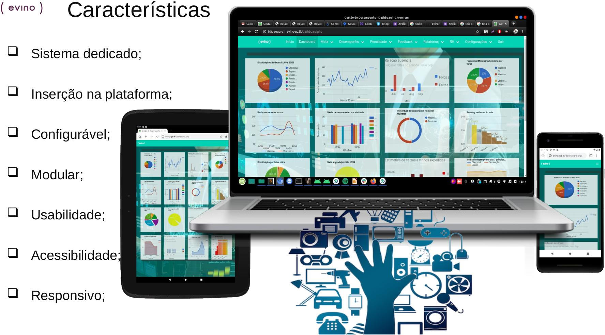

# ops-gestao-desempenho
<!-- Compatibilidade aprimorada do link de volta ao topo: Veja: https://github.com/othneildrew/Best-README-Template/pull/73 -->
<a name="readme-top"></a>

<br />
<div align="center">
  <a href="https://github.com/code-chip/ops-gestao-desempenho">
    
  </a>

  <h3 align="center">Gestão Desempenho</h3>

  <p align="center">
    Gestão de metas e desempenho do centro de distribuição no Espírito Santo - Brasil
    <br />
    <a href="https://evinobr.atlassian.net/wiki/spaces/TECH/pages/2396291159/Gamay"><strong>Explore a documentação »</strong></a>
    <br />
    <br />
    <a href="https://opsgestaodesempenho.tk/">Ver Demo</a>
    ·
    <a href="https://github.com/code-chip/ops-gestao-desempenho/issues">Reportar Bug</a>
    ·
    <a href="https://github.com/code-chip/ops-gestao-desempenho/issues">Solicitar Funcionalidade</a>
  </p>
</div>

<details>
  <summary><h2>Índice</h2></summary>
  <ol>
    <li>
      <a href="#about-the-project">Sobre o Projeto</a>
      <ul>
        <li><a href="#about-the-project-objective">Objetivo</a></li>
      </ul>
      <ul>
        <li><a href="#about-the-project-justification">Justificativa</a></li>
      </ul>
      <ul>
        <li><a href="#about-the-project-description">Descrição</a></li>
      </ul>
      <ul>
        <li><a href="#about-the-project-built-with">Tecnologias Utilizadas</a></li>
      </ul>
    </li>
    <li>
      <a href="#getting-started">Primeiros Passos</a>
      <ul>
        <li><a href="#getting-started-requirements">Requisitos</a></li>
        <li><a href="#getting-started-installation">Instalação</a></li>
        <li><a href="#getting-started-complementary-command">Comandos Complementares</a></li>
      </ul>
    </li>
    <li><a href="#roadmap">Planejamento</a></li>
    <li><a href="#contact">Contato</a></li>
  </ol>
</details>

<a name="about-the-project"></a>
## Sobre o Projeto



<a name="about-the-project-objective"></a>
### Objetivo

* Cadastrar Metas/Atividades;
* Monitoramento de Desempenho;
* Gerar Diversos Relatórios;
* Melhorar Avaliação de Desempenho;
* Alterar Regras de Bônus;
* Centralizar e Facilitar o Acesso à Informação;
* Apoio à Tomada de Decisão.

<a name="about-the-project-justification"></a>
### Justificativa

Registrar o desempenho individual de cada colaborador na operação do Centro de Distribuição da Evino no Espírito Santo diariamente, trazendo mais transparência e assertividade na tomada de decisões. :smile:

<a name="about-the-project-description"></a>
### Descrição

A plataforma permite a geração de diversos relatórios, dashboards e KPIs de forma dinâmica, facilitando o acompanhamento e a análise do desempenho individual e geral da empresa. Além disso, as informações geradas apontam para variações de desempenho entre pessoas, turnos, idade, tempo de serviço, processos e/ou atividades, mostrando onde há oportunidades de melhoria.

<p align="right">(<a href="#readme-top">voltar ao topo</a>)</p>

<a name="about-the-project-built-with"></a>
### Tecnologias Utilizadas


PHP 8.3
Javascript
JQuery
HTML
MySQL 8
CSS
Bulma CSS
Hover CSS

<p align="right">(<a href="#readme-top">voltar ao topo</a>)</p>

<a name="getting-started"></a>
## Primeiros Passos

<a name="getting-started-requirements"></a>
### Requisitos

- **Docker** 20.10.12+
- **Docker Compose** 1.25+
- **GIT** 2.25.1+

<a name="getting-started-installation"></a>
### Instalação

Etapa 1: Clonar o repositório

```
git clone git@github.com:code-chip/ops-gestao-desempenho.git opsgd && cd opsgd
```

Etapa 2: Construir a imagem docker

```
bin/dev build
```

Etapa 3: Iniciar o container da imagem
```
bin/dev up
```

Etapa 4: Acessar via navegador

```
http://localhost
```

<a name="getting-started-complementary-command"></a>
### Comandos Complementares

* ```bin/dev build``` força a (re)construção do stack docker-compose.
* `bin/dev rebuild` atualiza as imagens base do docker, reconstrói o stack, para os containers em execução e reinicia com as imagens novas.
* `bin/dev start` ou `bin/dev up` inicia o stack docker-compose.
* `bin/dev status` imprime o status atual do stack docker-compose.
* `bin/dev restart` reinicia o stack docker-compose.
* `bin/dev logs` imprime os logs do container especificado.
* `bin/dev console` inicia um bash no container `node`.
* `bin/dev stop` para todos os containers ativos do stack.
* `bin/dev down` para e remove todos os containers do stack.

<p align="right">(<a href="#readme-top">voltar ao topo</a>)</p>

<a name="roadmap"></a>
## Planejamento

- [x] Adicionar Changelog
- [x] Adicionar links de volta ao topo
- [ ] Adicionar passo a passo de configuração de base de dados
- [ ] Adicionar documento "componentes" para copiar e colar seções do readme
- [ ] Refatoração das funcionalidades
    - [x] Login
    - [ ] Dashboard
    - [ ] Meta
    - [ ] Performance
    - [ ] Penalidade
    - [ ] Feedback
    - [ ] Relatório
    - [ ] RH
    - [ ] Configurações

<p align="right">(<a href="#readme-top">voltar ao topo</a>)</p>

## Contato

Will - [code-chip](https://github.com/code-chip) - will@outlook.com

Link do Projeto: [https://github.com/code-chip/ops-gestao-desempenho](https://github.com/code-chip/ops-gestao-desempenho)

<p align="right">(<a href="#readme-top">voltar ao topo</a>)</p>